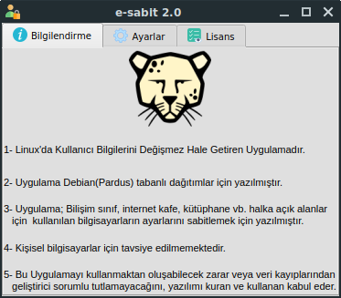
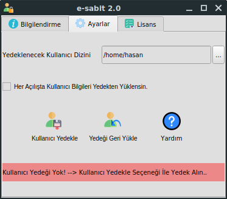
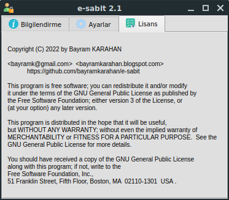
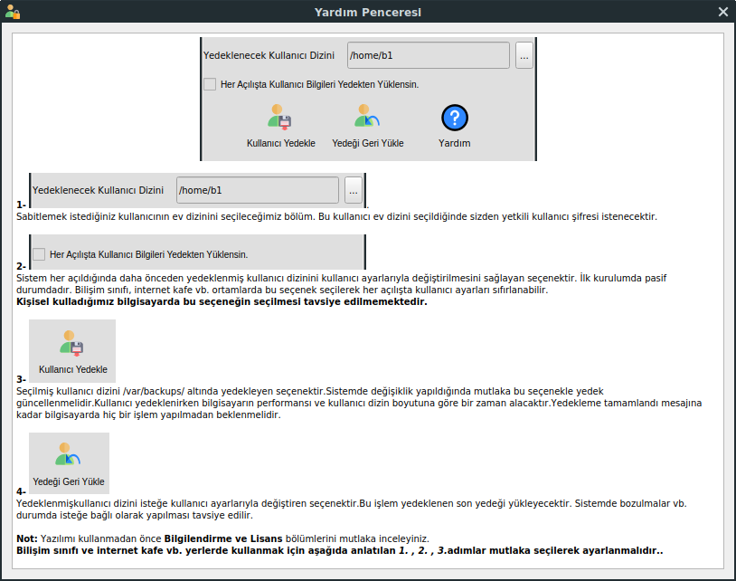

# e-sabit
Linux Kullanıcı Bilgilerini Dondurmak için Yazılan Bir Uygulama
 

 

 

 

 

 

Uygulama Qt ortamında c++ ile yazılmıştır..
Qt 5.11.2 versiyonu ile yazılmıştır.
 
gcc 4.9 versiyon kullanılmıştır..,
 
Derlemek için kodu indiriniz.. kod adında bir dizinde açtığınızı varsayalım
 
1-cd kod
 
2-mkdir build
 
3-cd build
 
4-qmake ../e-sabit.pro
 
5-make&make clean
 
6-make install
 
Bu işlemleri hatasız yaparsanız uygulama derlenecek ve sisteme yüklenecektir..
 
